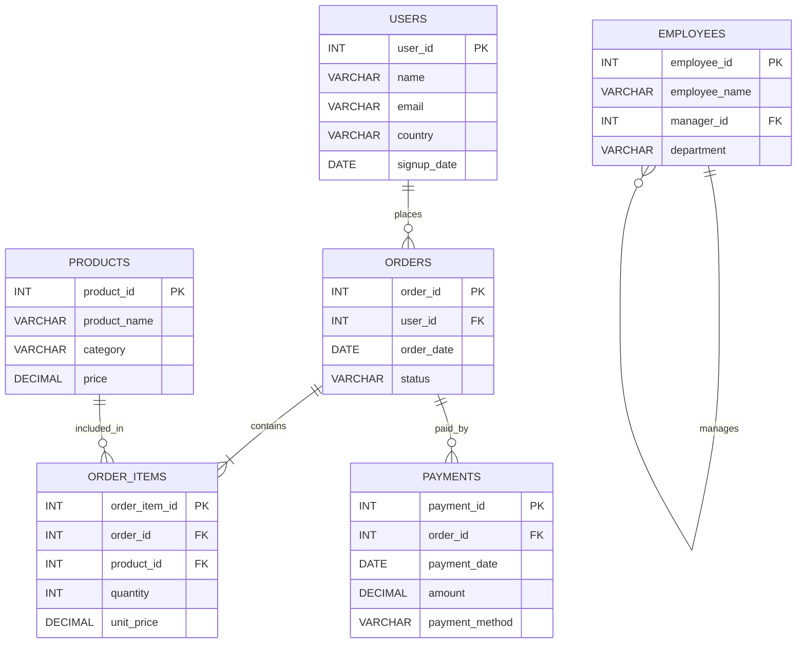

```mermaid
erDiagram

    USERS {
        INT user_id PK
        VARCHAR name
        VARCHAR email
        VARCHAR country
        DATE signup_date
    }

    ORDERS {
        INT order_id PK
        INT user_id FK
        DATE order_date
        VARCHAR status
    }

    ORDER_ITEMS {
        INT order_item_id PK
        INT order_id FK
        INT product_id FK
        INT quantity
        DECIMAL unit_price
    }

    PRODUCTS {
        INT product_id PK
        VARCHAR product_name
        VARCHAR category
        DECIMAL price
    }

    PAYMENTS {
        INT payment_id PK
        INT order_id FK
        DATE payment_date
        DECIMAL amount
        VARCHAR payment_method
    }

    EMPLOYEES {
        INT employee_id PK
        VARCHAR employee_name
        INT manager_id FK
        VARCHAR department
    }

    USERS ||--o{ ORDERS : places
    ORDERS ||--|{ ORDER_ITEMS : contains
    PRODUCTS ||--o{ ORDER_ITEMS : included_in
    ORDERS ||--o{ PAYMENTS : paid_by

    EMPLOYEES ||--o{ EMPLOYEES : manages
```
